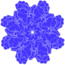

 
 

 

<strong>Rendering molecules for fun and profit</strong>

Yannic Ellhotka & Simon Wesp

 
 

# Prequesites

- [Node 22](https://nodejs.org/en/download)
- A browser with [WebGPU support](https://caniuse.com/webgpu)
- Optional but recommended [pnpm](https://pnpm.io/installation#using-corepack)

# How to run

1. `npm install`
2. `npm run dev`
3. Open [http://localhost:3000](http://localhost:3000). Make sure to test in a browser that supports WebGPU like new versions of Chrome.
4. Mesh rasterization example [http://localhost:3000/examples/molecules](http://localhost:3000/examples/molecules)
5. Ray marching example [http://localhost:3000/examples/ray-marching](http://localhost:3000/examples/ray-marching)

# Hosted version

[https://vis2-rtvis-2024ws.yannic.workers.dev/](https://vis2-rtvis-2024ws.yannic.workers.dev/)

# How to prepare molecule files

## Prequesites

- [GROMACS](https://www.gromacs.org/)
- [Gromologist](https://gitlab.com/KomBioMol/gromologist)

## Instructions

1. Pick a Computed Structure Models (CSMs) from [here](https://www.rcsb.org/search?request=%7B"query"%3A%7B"type"%3A"group"%2C"nodes"%3A%5B%7B"type"%3A"group"%2C"nodes"%3A%5B%7B"type"%3A"group"%2C"nodes"%3A%5B%7B"type"%3A"terminal"%2C"service"%3A"text"%2C"parameters"%3A%7B"attribute"%3A"rcsb_entry_info.structure_determination_methodology"%2C"operator"%3A"exact_match"%2C"value"%3A"computational"%7D%7D%5D%2C"logical_operator"%3A"and"%7D%5D%2C"logical_operator"%3A"and"%2C"label"%3A"text"%7D%5D%2C"logical_operator"%3A"and"%7D%2C"return_type"%3A"entry"%2C"request_options"%3A%7B"scoring_strategy"%3A"combined"%2C"results_content_type"%3A%5B"computational"%5D%2C"paginate"%3A%7B"start"%3A0%2C"rows"%3A25%7D%2C"sort"%3A%5B%7B"sort_by"%3A"score"%2C"direction"%3A"desc"%7D%5D%7D%2C"request_info"%3A%7B"query_id"%3A"086f7e81292c787a2b6e45142c3eea61"%7D%7D).
2. Download the models CIF file.
3. Convert the CIF to PDB [here](https://project-gemmi.github.io/wasm/convert/cif2pdb.html).
4. Run the `pdb_to_conect` notebook found in the `pdb-processing` folder.
5. The resulting pdb file can be used in this project.

If the conversion fails at step 4, you may have supplied an invalid molecule file. Through testing we found that many experimentally-determined PDB structures do strictly adhere to the pdb file format and cannot be parsed correctly.

Alternatively, try generating a topology file with the `create-topology.sh` bash script. Feed the topology file to gromologist alongside the cleaned pdb. You may get better results this way.

# Component Overview

## Camera

## Geometry

Holds all vertices and indices belonging to a piece of geometry. Has helper functions for writing vertex and index buffers to the GPU.

## Material

Holds a material and provides a function for writing data to the GPU.

## Object3D

Basic 3D object that holds all data required for calculating the model matrix.

## SceneObject

WebGPU-specific object that extends `Object3D` with `load`, `update` and `render` functions.

### Instancing

There is an instanced variant of the `SceneObject`. When the same `SceneObject` is used multiple times, using instancing can greatly boost performance.

It allows efficient endering of multiple copies of the same geometry with varying transformations and materials. This technique reduces the overhead of drawing numerous objects by batching them into a single draw call, enhancing performance.

## Scene

Wrapper object that holds a number of `SceneObjects` and provides functions for drawing and updating them.

## Renderer

The Renderer is responsible for loading and rendering scenes and managing related WebGPU-specific tasks.

## Protein File Parser

### PDB

pdb is the file format used by [RCSB protein data bank](https://www.rcsb.org/). We only support files with explicit `CONECT`instructions.

### mmCIF

mmCIF is meant to be the more modern replacement for pdb files. We recommend to convert mmCIF files to pdb instead of relying on our own parser implementation.

## Uniform Buffer

## WebGPU init

### custom mini framework

## SDF Texture for Ray Marching

## Ray Marching Shader

## Blending Example - page.svelte
